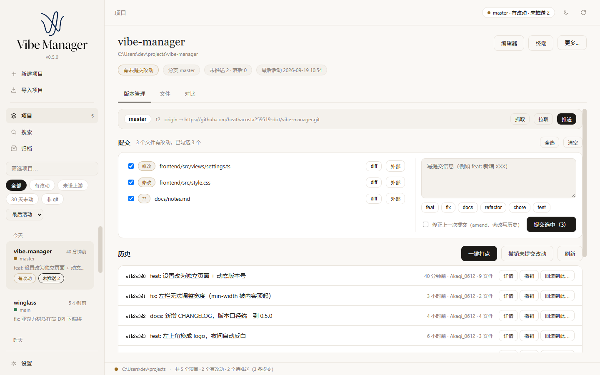
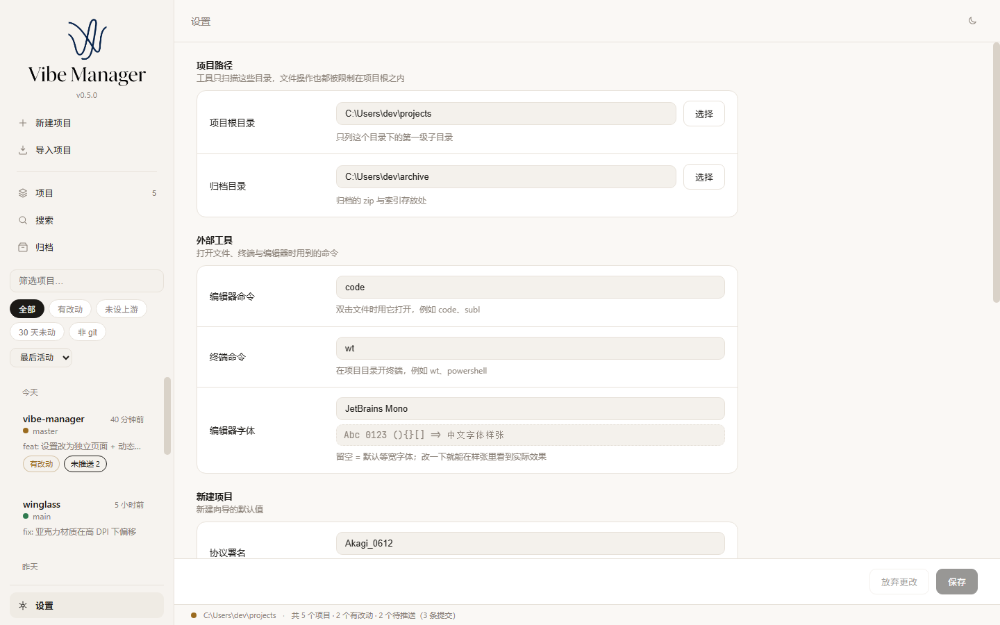
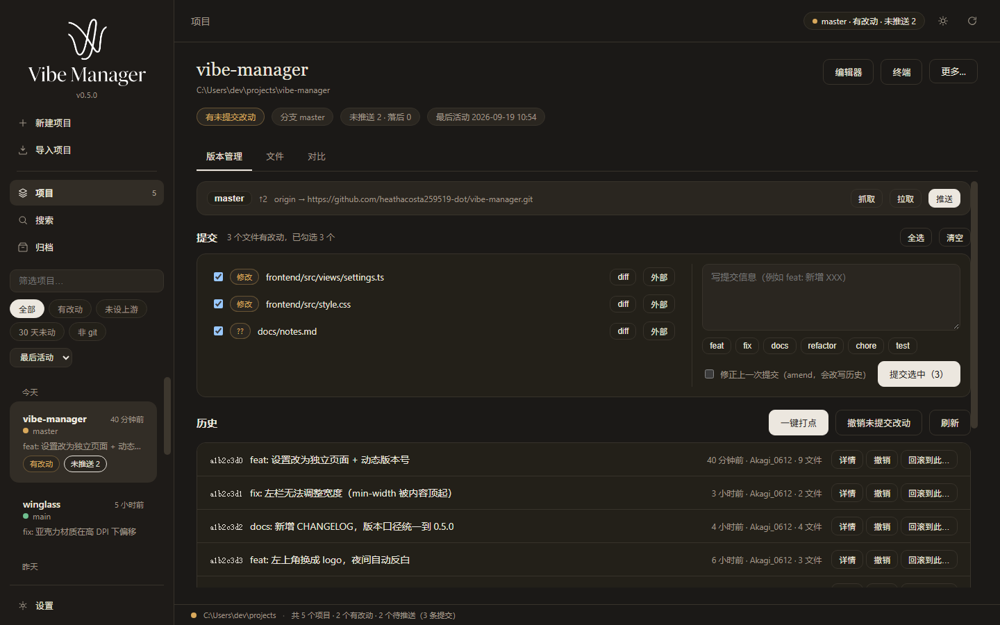

<div align="center">
  
  <h1>Vibe-Manager</h1>
  <p><b>VIBE CODING 项目管理器</b></p>
  <p>一句话生成一堆小项目，这个工具把它们管起来：<br/>
  一眼看清状态、随手打点、改坏了能回滚、不想要了能归档。</p>
  <p>
    <a href="../../releases/latest"></a>
    
    
    
    
    
  </p>
</div>

---

## 它解决什么

「一句话生成一个项目」很爽，但生成出来的东西很快会变成一堆没人认领的目录：不知道哪个还能跑、哪个改到一半、哪个早就不想要了。

Vibe-Manager 把这些项目收在一处，补上三件最缺的事：

- **看清状态** —— 每个项目的最后活动、git 脏净、当前分支、最近提交、未推送数、多久没动，一眼扫完。
- **改坏了能回滚** —— 任何破坏性操作之前自动留 stash 和保底标签，回滚不再是「看不见后果」的赌博。
- **不要了能归档** —— 打包成 zip 收进归档区，随时能还原回原路径。

界面全中文，双击即用的单个 exe。

## 截图

### 项目详情：远程同步、只提交勾选的文件、提交历史



### 设置：分组页面、常驻保存栏、编辑器字体实时预览



### 夜间主题

<p align="center"></p>

## 功能

**项目库**

- 扫描项目根，列出名称、最后活动时间、git 状态（脏 · 净）、当前分支、最近提交摘要、未推送提交数与「N 天未动」徽标
- 筛选（全部 · 有改动 · 未设上游 · 30 天未动 · 非 git）与排序（最后活动 · 名称 · 未推送数）
- 双击项目直接在资源管理器里打开

**新建项目**

- kebab-case 名称校验，逐项勾选要生成的内容：README.md / .gitignore / src/ / AGENTS.md / `git init` + 首次提交
- 内置 5 份 AGENTS.md 模板（通用工程化 · AI 代理精简版 · 前端 · 脚本 · C++），也可以自己写一份存下来
- 自选开源协议（MIT / Apache-2.0 / BSD-3-Clause / ISC / MPL-2.0 / GPL-3.0），署名默认取 git 全局 `user.name`

**导入项目与「实际根目录」**

- 项目根之外的目录可以直接导入列表
- 真仓库藏在子目录里时（比如 `winglass\WinGlass`），可以给这个条目指定「实际根目录」，此后 git、文件管理、全局搜索全部作用于真正的仓库

**文件管理 + 内置编辑器**

- 面包屑导航、前进 / 后退 / 上级 / 刷新，大图标与详细信息两种视图，排序、筛选、显示隐藏项，每个条目标注 git 状态
- 新建 / 重命名 / 删除到回收站 / 剪切 · 复制 · 粘贴 / 拖拽移动 / 多选（Ctrl · Shift · Ctrl+A）
- 右侧 CodeMirror 6 编辑器：17 种语言的语法高亮、行号、代码折叠、多光标、查找替换、`Ctrl+S` 原子写保存
- 大文件保护：超过 200 KB 关闭高亮，超过 2 MB 转只读

**版本管理（基于项目自身 git）**

- 提交历史与提交详情（新增 / 修改 / 删除 / 重命名）
- 一键打点、硬回滚、软回滚、撤销未提交改动
- **只提交勾选的文件**：文件清单 + 状态徽标 + diff 预览 + 提交信息前缀快捷键 + amend
- 分支与标签：切换 / 新建 / 删除 / 合并，标签创建与推送；删除未合并分支会被拦下
- revert 生成反向提交，不改写历史
- 远程同步：分支、↑↓ 计数、远程地址、代理提示，抓取 / 拉取 / 推送；无上游时一键「推送并设为上游」
- 版本对比页：列出两个版本之间变更的文件，逐文件展开完整 diff，带行号并初始滚动到首个改动
- 备份区：集中列出工具自动留下的 stash 与 `vibe-pm-backup-*` 标签，一键应用 / 回到该备份 / 删除

**全局搜索**

- 一次搜项目名、提交信息、文件名、文件内容；结果按项目分组，内容命中显示 `路径:行号` 并高亮关键词
- 点一下直接跳进对应项目的文件视图，并定位到命中行

**归档**

- 打包成 zip 存入归档目录并删除原目录；归档前若工作区有未提交改动，默认先打一次点
- 归档区可还原回原路径，支持按时间 / 名称 / 体积排序与删除

## 安全边界

这类工具最容易出事的地方是「手滑删错东西」，所以这些是硬规矩，不是可选项：

- 所有文件操作的路径都必须落在项目根之内，并防止符号链接逃逸
- 删除一律进 **Windows 回收站**，不提供永久删除。唯一例外是超过 260 字符、回收站接口本身就支持不了的路径，这种情况界面会明确警告并二次确认
- 覆盖前先把旧目标送进回收站，任何文件都不会被永久丢弃
- 复制 / 移动拒绝「到自己或自己的子目录」，避免无限递归造出路径炸弹
- 破坏性 git 操作（回滚、丢弃改动）之前自动 `git stash` 并打 `vibe-pm-backup-*` 标签兜底
- git 认证完全交给 git 自己（不设 `GIT_TERMINAL_PROMPT=0`），也**绝不覆盖仓库的 `http.proxy`**

## 安装

### 直接使用

从 [Releases](../../releases/latest) 下载 `Vibe-Manager.exe`，双击运行。内置 WebView2 渲染，Windows 11 自带运行时，不需要额外安装任何东西。

**首次运行**：项目根是空的（每个人的目录布局都不一样，猜一个默认值只会让人先踩坑），左侧列表会给出「新建项目 / 导入目录 / 打开设置」的引导。点「设置」把**项目根目录**指到你放项目的地方即可，它会扫描该目录下的第一级子目录。

### 从源码构建

前置：Go 1.25+、Node.js，以及 [Wails CLI](https://wails.io)。

```powershell
go install github.com/wailsapp/wails/v2/cmd/wails@latest

wails build          # 产物：build/bin/Vibe-Manager.exe
wails dev            # 开发模式（热重载）
```

后端测试：`go test ./...`

> 本仓库的 npm 配置用了 `omit=dev`，所以 `wails.json` 里的 `frontend:install` 显式带了 `--include=dev`，别删。

## 快捷键

### 编辑器

| 快捷键 | 作用 |
| --- | --- |
| `Ctrl+S` | 保存当前文件 |
| `Ctrl+F` | 编辑器内查找替换 |
| `Ctrl+空格` | 唤出补全 |

### 文件管理

| 快捷键 | 作用 |
| --- | --- |
| `F2` | 重命名选中项 |
| `Delete` | 删除到回收站 |
| `Ctrl+X` / `C` / `V` | 剪切 / 复制 / 粘贴 |
| `Ctrl+A` | 全选当前目录 |
| `Alt+←` / `→` | 前进 / 后退 |
| `Backspace` | 返回上一级目录 |
| `↑` `↓` `←` `→` | 在列表 / 网格中移动选中项 |

### 通用

| 快捷键 | 作用 |
| --- | --- |
| `Enter` | 打开文件（或项目文件夹） |
| `Esc` | 关闭弹窗 / 取消选择 |

## 数据放在哪

全部在 `%APPDATA%\vibe-pm\`，**绝不写进项目目录**，不会污染你的仓库：

| 文件 | 内容 |
| --- | --- |
| `config.json` | 界面配置：项目根、归档根、编辑器 / 终端命令、主题、窗口尺寸、编辑器字体 |
| `projects.json` | 项目元数据：备注名、实际根目录、导入列表 |
| `agents-templates.json` | 你自建的 AGENTS.md 模板 |
| `vibe-pm.log` | 运行日志。GUI 没有控制台，出错靠它留痕 |

## 技术栈

| | |
| --- | --- |
| 后端 | Go 1.25，文件 / git / zip / JSON 全走标准库，只有删除与隐藏控制台窗口用到少量 Windows syscall |
| 前端 | Wails v2 + TypeScript + Vite，无框架（vanilla，整块重绘 + 事件委托）；编辑器用 CodeMirror 6 |
| 产物 | 单个 exe，约 12.5 MB |

```
main.go / app.go     程序入口；app.go 上所有导出方法就是前后端 API 面
internal/config      配置与项目元数据读写
internal/gitx        全部 git 操作（历史/回滚、分支标签、远程、提交工作流、版本对比）
internal/fsx         文件管理器后端：路径校验、列举、读写、增删改移、内容搜索
internal/winfs       删除走 Windows 回收站
internal/execx       启动外部进程时隐藏控制台窗口
internal/project     项目扫描、骨架生成、内置模板、协议正文
internal/agents      AGENTS.md 模板（内置 + 用户自建）
internal/archive     打包 / 还原 / 删除归档
frontend/src         前端；api.ts 是访问后端的唯一入口，views/ 放各视图
```

## 已知限制

- 回滚只依赖项目自身 git，**只能恢复到已提交的状态**；未提交的改动要靠「一键打点」或工具自动 stash 兜底
- 归档会打包整个目录（含 `.git`），不做额外排除，所以体积等于项目原体积
- 非 git 项目只能浏览、打开、归档，没有版本功能
- `vibe-pm-backup-*` 标签会随回滚次数累积，可在「备份」区按需删除
- 只记住窗口大小，不记住位置（Wails v2 不暴露显示器坐标，无法安全校验，避免窗口跑到屏幕外）
- 回收站接口不支持超过 260 字符的路径，这类超深目录只能永久删除（界面会明确警告）
- 文件管理器的拖拽与快捷键只在「文件」模式下生效

## 还没做

多根扫描、体积统计、批量多选操作、CLI 模式、AI 集成、依赖管理、跑测试、CI。

## 更新日志

见 [CHANGELOG.md](CHANGELOG.md)。

## 许可

[MIT](LICENSE)
